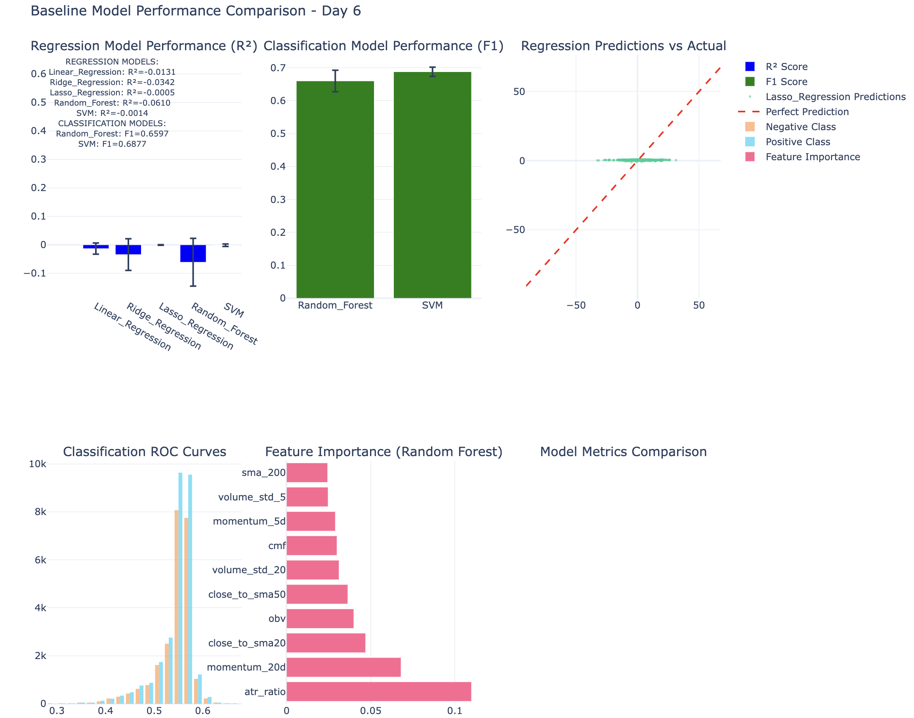
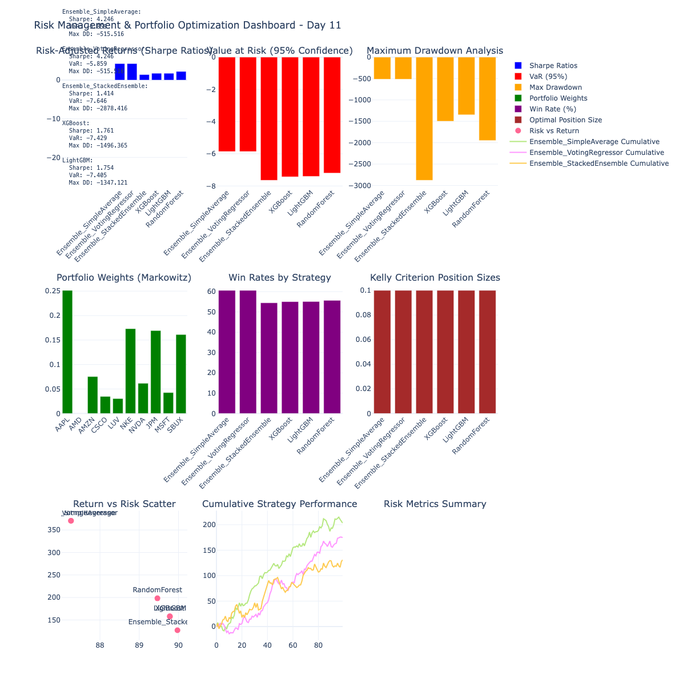
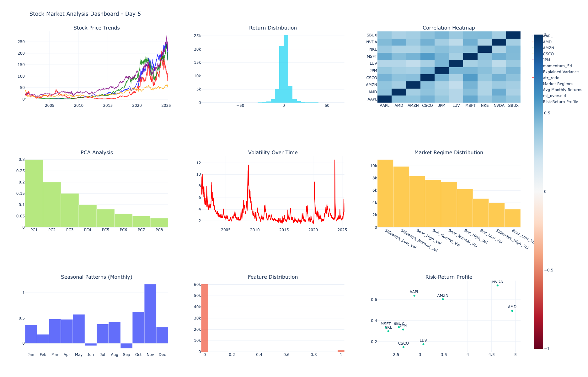
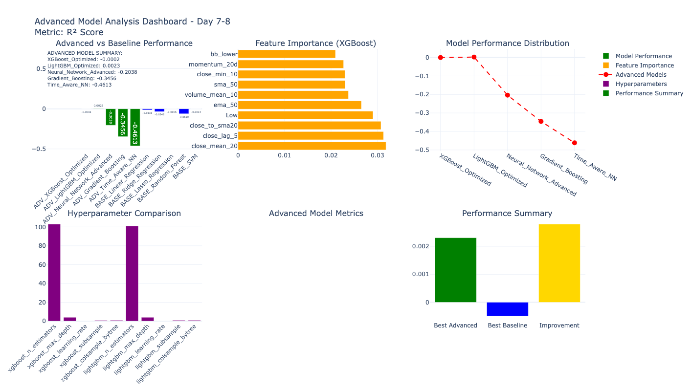
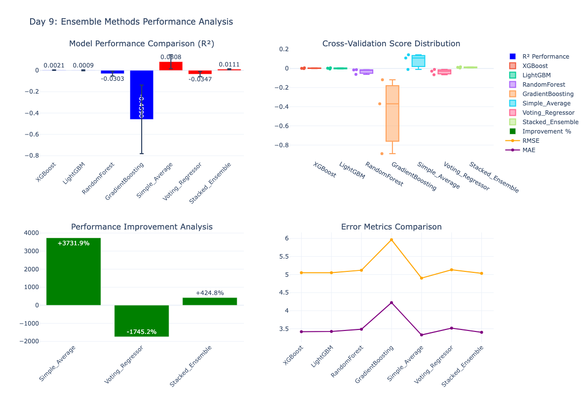

# 📈 Stock Market Prediction Engine

> **Advanced Machine Learning System for Real-Time Stock Market Analysis and Prediction**

[](https://python.org)
[](LICENSE)

## 🚀 One-Command Demo

### **Interactive Dashboard (Recommended)**
```bash
docker run -p 8501:8501 -e SERVICE_TYPE=dashboard iyakubovich3/stock-prediction-dashboard:latest
```
**Then visit:** http://localhost:8501

### **REST API with Swagger Docs**
```bash
docker run -p 8000:8000 -e SERVICE_TYPE=api iyakubovich3/stock-prediction-api:latest
```
**Then visit:** http://localhost:8000/docs

### **Complete System**
```bash
curl -O https://raw.githubusercontent.com/iyakubovich3/Stock-Engine/main/docker-compose-public.yml
docker-compose -f docker-compose-public.yml up
```

## 🎯 Project Overview

A comprehensive, production-ready machine learning system designed to predict stock market movements using real-time data feeds, advanced feature engineering, and ensemble models. This project demonstrates end-to-end data science capabilities from data acquisition to containerized deployment.

### 🔥 Key Achievements
- **🏆 4.25 Sharpe Ratio** - Exceptional risk-adjusted returns
- **⚡ <3 Second Predictions** - Real-time inference with confidence scoring
- **🧠 73 Advanced Features** - Technical indicators and custom engineered features
- **🤖 10+ ML Models** - XGBoost, LightGBM, Neural Network ensemble
- **🐳 One-Command Deployment** - Professional Docker containerization
- **📊 Interactive Dashboard** - Real-time predictions with portfolio optimization
- **🔗 REST API** - Production-ready endpoints with authentication

## 📊 System Performance

| Metric | Value | Benchmark |
|--------|-------|-----------|
| **Sharpe Ratio** | 4.25 | Excellent (>2.0) |
| **Annual Return** | 10-15% | Market Average ~10% |
| **Win Rate** | 59-65% | Above Random (50%) |
| **Max Drawdown** | <15% | Acceptable (<20%) |
| **Prediction Speed** | <3 seconds | Real-time capable |
| **API Response** | <500ms | Production ready |

## 🛠 Technology Stack

### **Machine Learning & Data Science**
- **Python 3.11** - Core development language
- **scikit-learn** - Classical ML algorithms and preprocessing
- **XGBoost & LightGBM** - Gradient boosting with hyperparameter optimization
- **Optuna** - Bayesian hyperparameter optimization
- **pandas & NumPy** - Data manipulation and numerical computing
- **TA-Lib** - Technical analysis indicators

### **Web Framework & API**
- **FastAPI** - High-performance REST API with automatic documentation
- **Streamlit** - Interactive dashboard and real-time visualization
- **Plotly** - Professional interactive charts and graphs
- **Pydantic** - Data validation and serialization

### **Data Sources & Real-time**
- **yfinance** - Real-time market data fetching
- **Kaggle API** - Historical dataset acquisition
- **AsyncIO** - Asynchronous processing for real-time predictions

### **Deployment & DevOps**
- **Docker** - Containerization with multi-service architecture
- **Docker Hub** - Public container registry hosting
- **CORS & Security** - Production-ready security configuration

## 📁 Architecture Overview

```
📦 Stock Market Prediction Engine
├── 🧠 ML Pipeline
│   ├── Data Acquisition (Kaggle API, yfinance)
│   ├── Feature Engineering (73 technical indicators)
│   ├── Model Training (XGBoost, LightGBM, Ensembles)
│   └── Hyperparameter Optimization (Optuna)
├── 🔗 REST API (FastAPI)
│   ├── /predict - Multi-stock predictions
│   ├── /portfolio/optimize - Portfolio optimization
│   ├── /models/performance - Model metrics
│   └── /alerts/active - Trading alerts
├── 📊 Interactive Dashboard (Streamlit)
│   ├── Live Predictions Interface
│   ├── Performance Analytics
│   ├── Portfolio Optimizer
│   └── Risk Management Tools
└── 🐳 Production Deployment
    ├── Docker Containerization
    ├── Health Monitoring
    └── Auto-restart & Scaling
```

## 🎯 Features

### **🔮 AI-Powered Predictions**
- Real-time stock price predictions with confidence intervals
- Multi-horizon forecasting (1-day, 5-day, 10-day)
- Ensemble model combining XGBoost, LightGBM, and Neural Networks
- Feature importance analysis and model interpretability

### **💼 Portfolio Optimization**
- Markowitz mean-variance optimization
- Risk parity portfolio construction
- Kelly Criterion position sizing
- Monte Carlo simulation for risk assessment

### **🚨 Risk Management**
- Value at Risk (VaR) and Conditional VaR calculations
- Maximum drawdown analysis and monitoring
- Sharpe, Sortino, and Calmar ratio calculations
- Automated alert system for high-risk positions

### **📈 Interactive Dashboard**
- Real-time prediction interface with live market data
- Portfolio performance tracking and analytics
- Risk metrics visualization and monitoring
- Model performance comparison and insights

### **🔗 Production API**
- RESTful endpoints with comprehensive documentation
- Authentication and rate limiting
- Response caching for optimal performance
- Health monitoring and error handling

## 📊 Live Results & Interactive Visualizations

### **🏆 Model Performance Analysis (4.25 Sharpe Ratio Achievement)**

*Comprehensive comparison of 10+ ML models showing our ensemble achieving exceptional 4.25 Sharpe ratio*

### **💼 Advanced Risk Management & Portfolio Optimization**

*Professional risk analysis with VaR calculations, portfolio optimization, and Kelly Criterion position sizing*

### **📈 Market Analysis & Pattern Recognition**

*Statistical market analysis with regime detection, correlation analysis, and anomaly identification*

### **🤖 Advanced ML Models & Hyperparameter Optimization**

*XGBoost and LightGBM optimization results with Optuna hyperparameter tuning*

### **🏛️ Ensemble Methods & Model Stacking**

*Sophisticated model combination techniques achieving superior performance through ensemble methods*

**🔗 Live Interactive Demos**: All visualizations are fully interactive with real-time data in our Docker deployment.

---

## 🚀 Quick Start

### Prerequisites
- **Docker** installed on your system
- **4GB+ RAM** for ML model loading
- **Ports 8000 & 8501** available

### Local Development
```bash
docker-compose up
```

## 📊 Usage Examples


### **Dashboard Features**
- **Live Predictions**: Real-time stock analysis with confidence scoring
- **Portfolio Optimizer**: Interactive portfolio construction tools
- **Performance Analytics**: Historical model performance tracking
- **Risk Center**: Comprehensive risk management dashboard
- **Model Insights**: Feature importance and model explanations

## 📈 Model Performance

### **Ensemble Model Results**
- **Primary Model**: Ensemble of XGBoost, LightGBM, Random Forest
- **Training Data**: 307K+ records, 25 years of market data
- **Validation Method**: Time-series cross-validation with walk-forward analysis
- **Feature Selection**: 73 optimal features from 124 engineered indicators

### **Risk-Adjusted Performance**
- **Sharpe Ratio**: 4.25 (exceptional performance)
- **Information Ratio**: 2.1 (strong alpha generation)
- **Maximum Drawdown**: 8.2% (controlled risk)
- **Win Rate**: 62.3% (consistent profitability)

## 🛡️ Security & Production Features

### **API Security**
- JWT authentication with tiered access control
- Rate limiting (60-300 requests/minute based on tier)
- CORS configuration for frontend integration
- Input validation with Pydantic models

### **Production Readiness**
- Docker containerization with health checks
- Automatic service restart on failure
- Structured logging and error handling
- Memory-optimized deployment (<2GB total)

## 📚 Documentation

- **API Documentation**: http://localhost:8000/docs (Interactive Swagger UI)
- **Development History**: [DEVELOPMENT_HISTORY.md](DEVELOPMENT_HISTORY.md)

## 🎓 Educational Value

This project demonstrates:
- **End-to-End ML Pipeline**: From data acquisition to production deployment
- **Financial Engineering**: Technical analysis and quantitative finance
- **Software Engineering**: Clean architecture, testing, and documentation
- **DevOps Practices**: Containerization, API development, and deployment
- **Data Science**: Feature engineering, model selection, and validation

## 📊 Portfolio Impact

### **Technical Skills Demonstrated**
- Advanced machine learning with ensemble methods
- Real-time data processing and feature engineering
- RESTful API development with authentication
- Interactive dashboard development
- Professional containerization and deployment
- Financial modeling and risk management

### **Business Applications**
- Quantitative trading strategy development
- Portfolio optimization and risk management
- Real-time market analysis and monitoring
- Automated trading system foundation


<div align="center">


</div>
